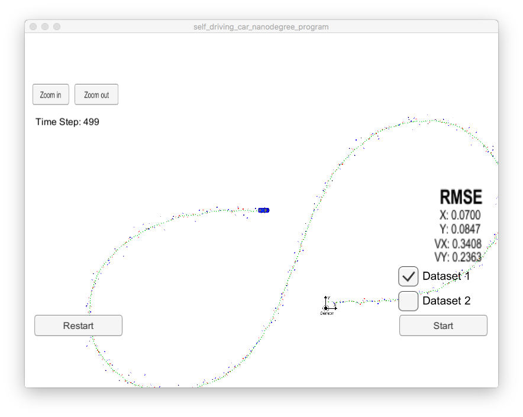
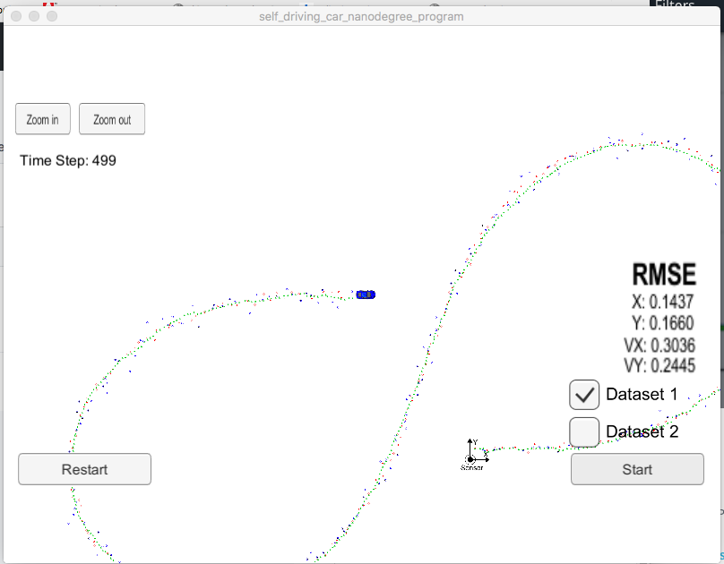

<h1>The Unscented Kalman Filter</h1>

<h2>Updated to include LIDAR update at July 23 11:19 AM CDT</h2>
I had forgotten to update the x_ and P_ variables after doing all the LIDAR calcs.
Adding it brought the RMSE values well within the  RUBRIC

<pre>
  // initial covariance matrix
  P_ = MatrixXd(5, 5);
  P_ << 0.9, 0, 0, 0,0,
          0, 0.9, 0, 0,0,
          0, 0, 0.9, 0,0,
          0, 0, 0, 0.9,0,
          0, 0, 0, 0,0.9;

  // Process noise standard deviation longitudinal acceleration in m/s^2
  std_a_ = 2; //30;

  // Process noise standard deviation yaw acceleration in rad/s^2
  std_yawdd_ = 1.5; //30;
</pre>

  
  <h3>Results:</h3>
  
